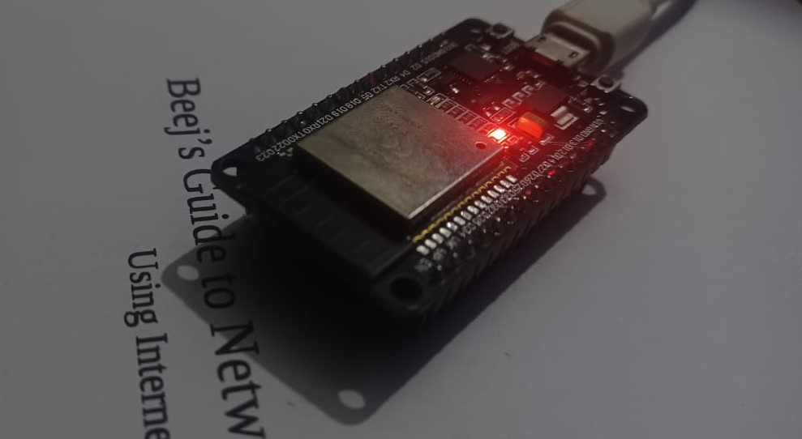
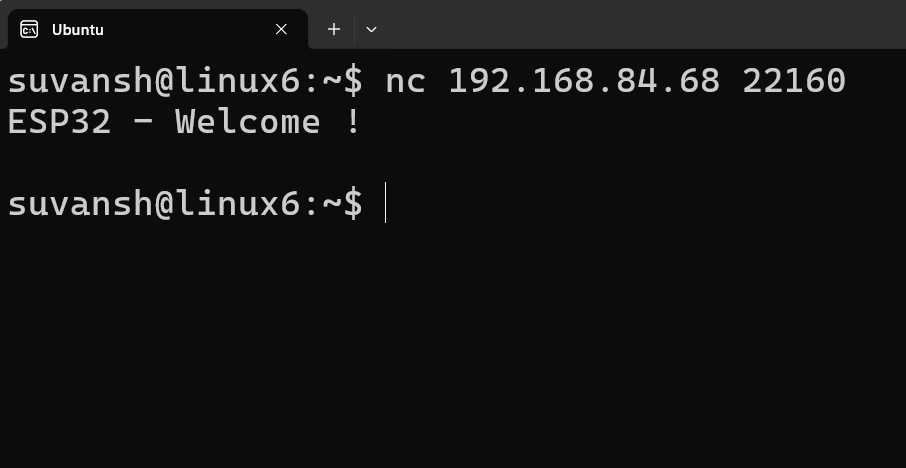

# ESP32 TCP Server with Wi-Fi Connectivity

This project demonstrates how to create a TCP server running on an ESP32, with Wi-Fi connectivity. The server listens for incoming TCP connections, accepts them, and sends a welcome message to the client. Additionally, it connects to a Wi-Fi network using the provided SSID and password, and handles Wi-Fi events like connection and disconnection.

### Images

- 
- 


## Features

- **TCP Server**: The server listens on a specified port and sends a welcome message to the connected clients.
- **Wi-Fi Connectivity**: Connects the ESP32 to a specified Wi-Fi network and handles reconnections.
- **HTTP GET Handler**: Simple HTTP handler for responding to GET requests with a message.
- **Event-driven Wi-Fi Management**: Automatically reconnects when the Wi-Fi connection is lost.

## Requirements

- ESP32 Dev Board
- ESP-IDF (Espressif IoT Development Framework)
- C compiler (GCC)
- Network environment for testing (e.g., a local network or a router)

## Setup

### 1. Install ESP-IDF

Follow the official ESP-IDF installation guide:  
https://docs.espressif.com/projects/esp-idf/en/latest/esp32/get-started/

### 2. Clone the repository

```bash
git clone https://github.com/sudoXpg/ESP32-TCP-Server.git
cd esp32-tcp-server
```

### 3. Configure Wi-Fi Credentials

Modify the `WIFI_SSID` and `WIFI_PWD` macros in the `main.c` file with your network's SSID and password:

```c
#define WIFI_SSID "your_wifi_ssid"
#define WIFI_PWD  "your_wifi_password"
```

### 4. Build and Flash

Use the ESP-IDF build system to compile and flash the application to your ESP32 board.

```bash
idf.py set-target esp32
idf.py build
idf.py flash
```

### 5. Monitor the output

After flashing, use the following command to view the serial output:

```bash
idf.py monitor
```

## How It Works

### 1. Wi-Fi Connection

The `wifi_connect()` function initializes the Wi-Fi stack, connects to the specified Wi-Fi network, and handles events such as disconnections and reconnections.

- **WIFI_EVENT_STA_START**: Starts the Wi-Fi connection process.
- **WIFI_EVENT_STA_DISCONNECTED**: Handles Wi-Fi disconnections and attempts to reconnect.
- **IP_EVENT_STA_GOT_IP**: When the ESP32 receives an IP address, it logs the IP address and confirms that the Wi-Fi connection is established.

### 2. TCP Server

The `tcp_server()` function sets up a TCP server that listens for incoming client connections on a specified port. When a client connects, it sends a welcome message:

- The server is bound to a port (`PORT`) and listens for connections.
- Once a client is accepted, the server sends the message `"ESP32 - Welcome !"` to the client.
- After the message is sent, the connection is closed.

### 3. HTTP GET Handler (Optional)

The `hello_get_handler()` function handles HTTP GET requests. It responds with `"Hello There!\n"` when a GET request is made to the server.

## Event Handler

The event handler manages Wi-Fi and IP events:

- **WIFI_EVENT**: Handles Wi-Fi connection and disconnection.
- **IP_EVENT**: Handles IP assignment and logs the IP address of the ESP32.

## Files

- `wifi_connect.h`: Wi-Fi connection logic and event handling.
- `server.h`: TCP server functionality to handle incoming connections.
- `main.c`: Main program that sets up Wi-Fi, TCP server, and event handling.

## License

This project is licensed under the MIT License - see the [LICENSE](LICENSE) file for details.

## Acknowledgements
- ESP32 by Espressif Systems
- ESP-IDF Documentation and Examples
- Beej's Networking guide
